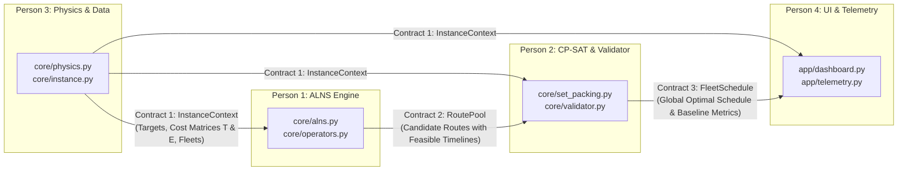

# AeroScan-Optima: 4-Person Engineering Sharding & Interface Contracts

## Executive Summary: Zero-Interference Architecture
To develop **AeroScan-Optima** rapidly without team members blocking one another or creating merge conflicts, the codebase is partitioned into **4 decoupled sub-systems** governed by **strict JSON/dataclass interface contracts**. Each engineer owns dedicated directories, runs independent unit tests, and uses mock data fixtures until final integration.

---

## 1. Team Role & Ownership Matrix

| Engineer | Title & Role | Core Domain & Ownership | Key Deliverables |
| :--- | :--- | :--- | :--- |
| **Person 1** | **Lead Metaheuristic Engineer** | **Tier-1 Single-Drone Route Exploration Engine** | `core/alns.py`, `core/operators.py`, `core/local_search.py`<br>ALNS framework, 4 destroy & 3 repair ops, 2-opt slack filling, candidate route pool generation. |
| **Person 2** | **Mathematical Optimization Engineer** | **Tier-2 Exact CP-SAT Solver & Baselines** | `core/set_packing.py`, `core/validator.py`, `baselines/grasp.py`, `baselines/genetic.py`<br>0-1 Set Packing ILP master problem, constraint validator (15% reserve, subtours), baseline comparisons. |
| **Person 3** | **Aerodynamics & Benchmark Engineer** | **Physics Engine, Coordinate Systems & Benchmarks** | `core/physics.py`, `core/instance.py`, `benchmarks/chao_loader.py`, `benchmarks/benchmark_runner.py`<br>BEMT hover power, forward drag polars, wind vector drift, Chao benchmark suite, automated harness. |
| **Person 4** | **Full-Stack Mission Control UI Engineer** | **Interactive Dashboard, Telemetry Simulator & Exporter** | `app/dashboard.py`, `app/visualizer.py`, `app/telemetry.py`, `app/arena_view.py`, `app/exporter.py`<br>Streamlit dashboard, time-slider mission scrubber, side-by-side arena, QGroundControl/MAVLink export. |

---

## 2. Interface Contracts & Data Flow



---

## 3. Strict Interface Contracts

### Contract 1: `InstanceContext` (Produced by Person 3 $\to$ Consumed by Persons 1, 2, 4)
Defines all targets, depots, wind conditions, and precomputed asymmetric time/energy matrices.
```python
from dataclasses import dataclass
from typing import List, Dict, Tuple
import numpy as np

@dataclass
class TargetNode:
    id: int                     # 0..N-1 for targets, N..N+2K-1 for depots
    name: str                   # Human-readable identifier
    x: float                    # Metric X coordinate (meters, UTM)
    y: float                    # Metric Y coordinate (meters, UTM)
    elevation: float            # Altitude in meters
    priority_score: float       # Search priority (0..100)
    dwell_time: float           # Sensor inspection dwell in seconds (e.g. 30s)

@dataclass
class DroneSpec:
    id: str                     # e.g., "UAV-01"
    battery_joules: float       # Total usable battery capacity (Joules)
    safety_reserve_ratio: float # Default 0.15 (15% reserve floor)
    max_flight_time: float      # Hard flight deadline in seconds (e.g. 2400s)
    cruise_speed: float         # Airspeed in m/s (e.g. 14.5 m/s)
    launch_depot_id: int        # Node ID of launch base
    recovery_depot_id: int      # Node ID of landing base

@dataclass
class InstanceContext:
    instance_name: str
    targets: List[TargetNode]
    drones: List[DroneSpec]
    time_matrix: np.ndarray     # Shape: [TotalNodes, TotalNodes], time in seconds (asymmetric)
    energy_matrix: np.ndarray   # Shape: [TotalNodes, TotalNodes], energy in Joules (asymmetric)
    ambient_wind: Tuple[float, float] # (speed_mps, direction_rad)
```

---

### Contract 2: `RoutePool` (Produced by Person 1 $\to$ Consumed by Person 2)
Defines the pool of single-drone feasible trajectories discovered by ALNS.
```python
@dataclass
class WaypointVisit:
    node_id: int
    arrival_time: float         # Continuous seconds from mission start
    departure_time: float       # arrival_time + dwell_time
    energy_consumed: float      # Cumulative energy consumed up to this point (Joules)

@dataclass
class CandidateRoute:
    drone_id: str               # Eligible drone identifier
    target_ids: List[int]       # Visited target node IDs in sequence (excluding depots)
    waypoints: List[WaypointVisit] # Full trajectory including launch and recovery depots
    total_reward: float         # Sum of priority rewards of visited targets
    total_flight_time: float    # Return time to recovery depot (seconds)
    total_energy_joules: float  # Total energy burn (must be <= 0.85 * battery_joules)

@dataclass
class RoutePool:
    routes_by_drone: Dict[str, List[CandidateRoute]] # Key: drone_id, Value: list of candidate routes
```

---

### Contract 3: `FleetSchedule` (Produced by Person 2 $\to$ Consumed by Person 4)
Defines the final certified optimal mission plan and comparative baseline results.
```python
@dataclass
class FleetSchedule:
    status: str                 # "OPTIMAL", "FEASIBLE", or "INFEASIBLE"
    solve_time_seconds: float   # Execution latency in seconds
    cumulative_reward: float    # Sum of unique collected target rewards
    assigned_routes: List[CandidateRoute] # Selected routes (at most 1 per drone)
    unassigned_targets: List[int] # Target IDs not visited
    validation_passed: bool     # True if 0% battery violation and 0% subtours
    baseline_grasp_reward: float# Comparative GRASP baseline score
    baseline_ga_reward: float   # Comparative Genetic Algorithm score
    reward_gain_percent: float  # ((cumulative_reward - grasp_reward) / grasp_reward) * 100
```

---

## 4. Work Independence & Mock Fixtures (Day 0 Kickoff)

To ensure **immediate parallel progress**:
- **Person 1** uses `tests/mock_instance.py` (synthetic 20-target Euclidean instance) to test ALNS operators without waiting for Person 3's physics engine.
- **Person 2** uses `tests/mock_routes.py` (synthetic 50 candidate routes) to build and solve the CP-SAT Set Packing problem in isolation.
- **Person 3** runs standalone tests on aerodynamic curves and loads standard Chao benchmark text files without needing solver logic.
- **Person 4** uses `tests/mock_schedule.json` to build the entire Streamlit dashboard, map rendering, time-slider scrubber, and MAVLink exporter without waiting for any backend solver.

---

## 5. Development Milestones & Integration Points

1. **Sprint 1 (Hours 0–12)**: Independent module development against mock contracts; unit tests passing in each directory.
2. **Sprint 2 (Hours 12–24)**: Integration Point 1: Person 3 outputs real `InstanceContext` $\to$ Person 1 feeds real instances into ALNS $\to$ Person 2 runs CP-SAT on ALNS route pools.
3. **Sprint 3 (Hours 24–36)**: Integration Point 2: Person 2 connects solver pipeline to Person 4's Streamlit Dashboard $\to$ Live end-to-end interactive demo.
4. **Sprint 4 (Hours 36–48)**: Full Chao 387-benchmark execution $\to$ Final presentation polish and video walkthrough.
